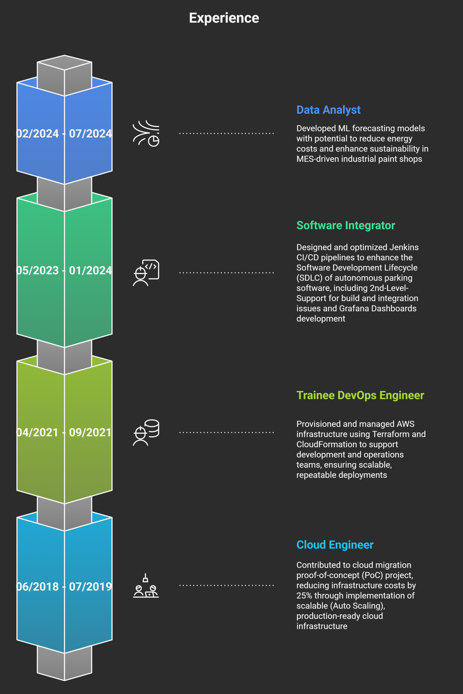
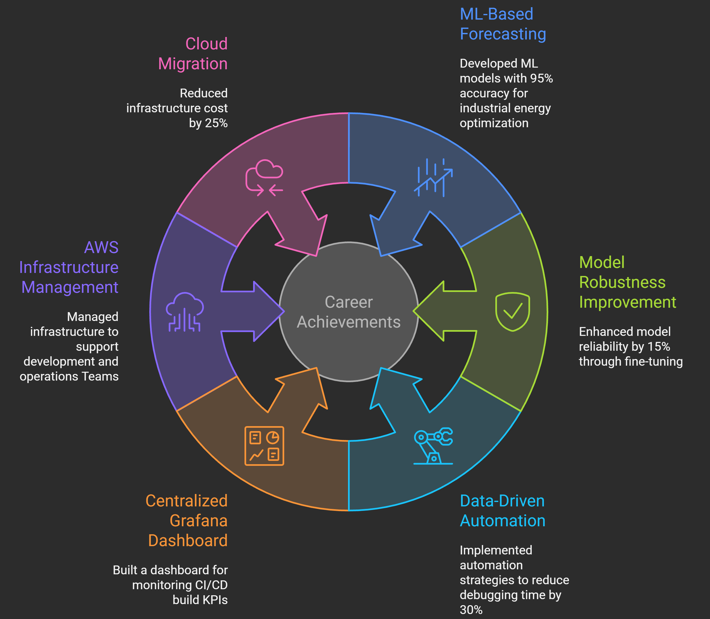

# Pavan Kumar Adapala

DevOps Engineer with around 3 years of experience in provisioning scalable on-premises and cloud infrastructures, developing GitOps-driven CI/CD pipelines for containerized applications, and implementing monitoring/observability solutions to enhance deployment reliability and reduce operational costs. Proven success in reducing build failure debugging time by up to 30%, enabling faster and more stable application delivery. 

## Skills

## Experience

## Impacts

## GitHub Insights

