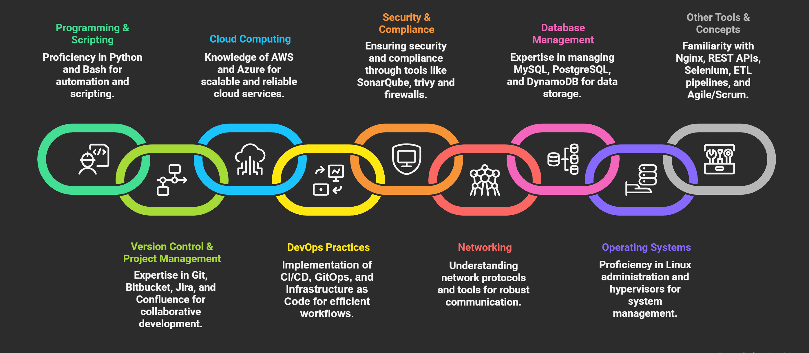

# Pavan Kumar Adapala

DevOps Engineer with 3 years of experience in Cloud and DevOps environments, focused on reducing delivery friction and operational overhead. Designed and implemented data-driven automation across CI/CD pipelines and GitOps workflows, significantly cutting build failure root-cause identification time and eliminating manual analysis of test reports and build artifacts. Proven expertise in integrating observability and security tooling—Grafana, Prometheus, SonarQube—and provisioning highly available, disaster-resilient infrastructure to deliver reliable, production-ready platforms.

## Skills

## Experience

## GitHub Insights

